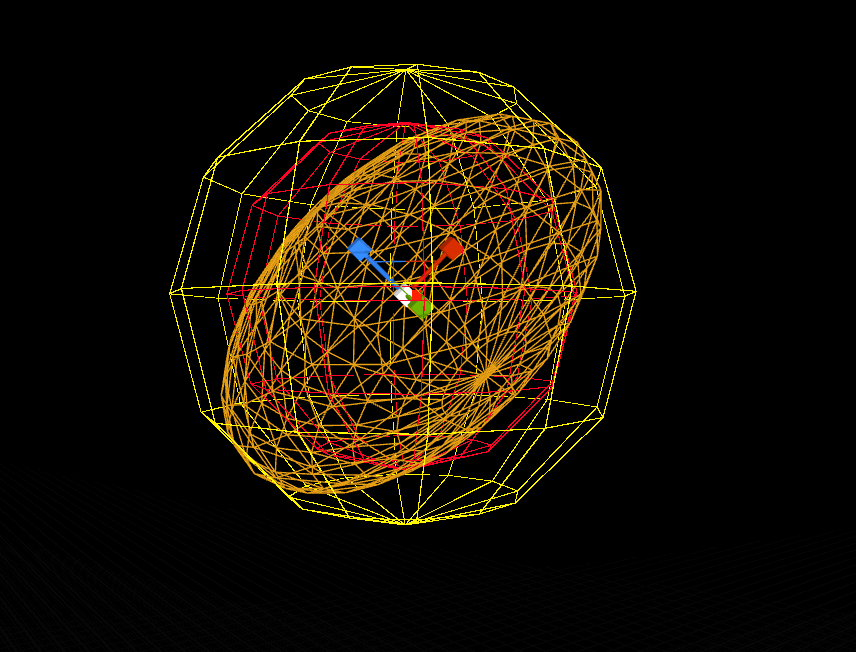
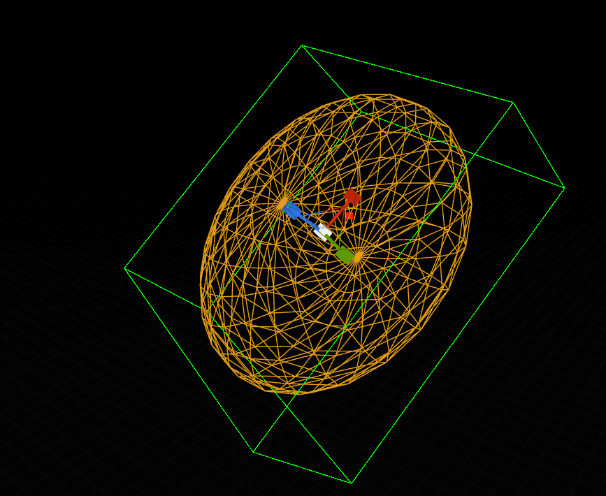
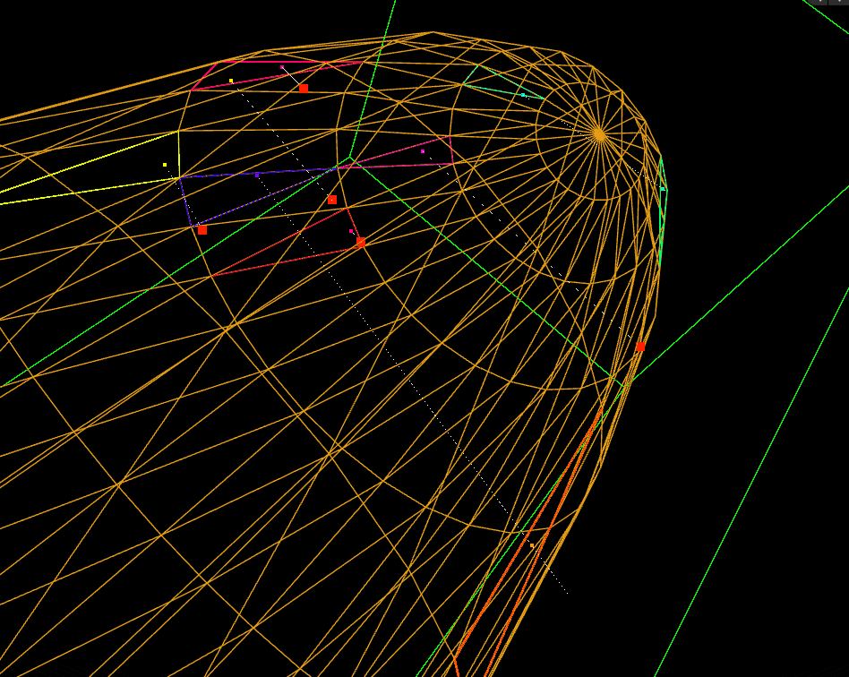

# MeshVectorGenerator
*A solution for generating points within the bounds of scaled and rotated meshes in Unreal*
Download the plugin [**here**]([https://github.com/GBaath/UnrealPlugins/tree/main/Plugins/GB_GeometryFunctions])

This work is made in conjuction with the [**Unreal Product configurator**](https://github.com/GBaath/Portfolio/tree/main/UnrealProductConfigurator) and it's main use case is to generate points within specifed bounds, for camera interpolation in order to get some variety while still being easy to iterate on and visualize. demo of this at the bottom of the page.


---


***TLDR:*** Read all the vertecies, and ranomize points within sphere or box, check rayintersection with the transformed input mesh, optimizing the generation space overtime.
Big & bulky mesh = faster, generating bounding volume not meant for realtime. 

---
# **DEMO**

*Works for scaled and rotated meshes as long as they're whole, generate the bounding shape (green box/red & yellow spheres) before generating points (red dots)*


<table>
  <tr>
<td width="50%">
<td width="50%">
  </tr>
</table>

<table>
  <tr>
<td width="50%">
<td width="50%">
  </tr>
</table>

---

# Generate Bounding Volume
Generate vectors within limits of box or sphere depending on best fit

*Mesh is quite uniform - boundingsphere is most optimal, yellow = max Radius, red = avarage*



*Mesh is more stretched/slim, box is the better fit*




<details>
<summary>GetDataFromVertecies</summary>

 ```cpp
//call this before generating point
void UVolumeInterpolator::Init(UStaticMeshComponent* Mesh, const FTransform WT)
{
    FJsonSerializableArrayInt Triangles;
    TArray<FVector> Normals;

    //save vertex data for point in polygon alg
    GetDataFromVerticies(Mesh, WT, Vertecies, Triangles, Normals, AvarageRadius, LargestRadius, BoxvolumeIsSmallest);
}


void UVolumeInterpolator::GetDataFromVerticies(UStaticMeshComponent* Mesh, const FTransform WT, TArray<FVector>& Verts, FJsonSerializableArrayInt& TriangleIndexes, TArray<FVector>& Normals,
    float& OutAvgRadiusToCenter, float& OutMaxRadiusToCenter, bool& bBoxIsSmallestBoundingShape) {

    OutMaxRadiusToCenter = 0;
    OutAvgRadiusToCenter = 0;

    TArray<FVector2D> UV;
    TArray<FProcMeshTangent> Tangents;
    UKismetProceduralMeshLibrary::GetSectionFromStaticMesh(Mesh->GetStaticMesh(), 0, 0, Verts, TriangleIndexes, Normals, UV, Tangents);
    float MagnitudeValues = 0;
    float Radius = 0;

    FOrientedBox Box;


    //REPLACE FUNCTION WITH VARIABLES SET FROM START
    //verts are localspace
    UVolumeInterpolator::GetSmallestBoundingShape(WT, Verts, Radius ,bBoxIsSmallestBoundingShape);
    UE_LOG(LogTemp, Warning, TEXT("%d"), Radius);

    //Randomize point using radius or box depening on smallest error margin 
    if (bBoxIsSmallestBoundingShape) {
        return;
    }
    else {
        //find avarageradius
        for (FVector& vert : Verts) {

            UCommonFunctions::TransformVector(vert, WT);
            //UKismetSystemLibrary::DrawDebugPoint(Mesh, vert, 3.f, FLinearColor::Red, 5.f

            float Magnitude = (vert - WT.GetLocation()).Length();
            MagnitudeValues += Magnitude;
        }
        if (Verts.Num() <= 0) {
            UE_LOG(LogTemp, Warning, TEXT("Verticies Array is 0"));
            return;
        }

        OutAvgRadiusToCenter = MagnitudeValues / Verts.Num();
        OutAvgRadiusToCenter;
        OutMaxRadiusToCenter = Radius;
        OutMaxRadiusToCenter;
    }
    return;
}


```
</details>
<details>
<summary>GetSmallestBoundingShape</summary>

 ```cpp
//this should not be recalculated during runtime
void UVolumeInterpolator::GetSmallestBoundingShape(const FTransform WT, TArray<FVector> Verts, float& OutRadius , bool& BoxIsSmallest) {


    UE::Geometry::TMinVolumeBox3<float> box;

    Vertecies = Verts;


    TFunctionRef<FVector3f(int32)> GetVertexInWorldSpace =
        [Verts,WT](int32 i) {

        FVector V  = Verts[FMath::Clamp(i, 0, Verts.Num() - 1)];
        UCommonFunctions::TransformVector(V, WT);

        return (FVector3f)V;
        };

    //get smallest boundingbox
    UE::Geometry::FOrientedBox3f OBox;

    //Solve is somewhat unreliable
    int i = 0;
    int maxTries = 10;
    do {
        box.Solve(Verts.Num(), GetVertexInWorldSpace, true);
        i++;
    } while (i < maxTries || !box.IsSolutionAvailable());

    if (box.IsSolutionAvailable()) {
        box.GetResult(OBox);
    }
    else
    {
        UE_LOG(LogTemp, Warning, TEXT("Failed To Solve BoxVolume"));

        BoxIsSmallest = false;
        //return SphereData
        //largest radius is smallest boundingbox
        float LRadius = 0.f;
        for (FVector& vert : Verts) {
            FVector V = vert;
            UCommonFunctions::TransformVector(V, WT);
            //UCommonFunctions::TransformVector(V, WorldTransform);
            UKismetSystemLibrary::DrawDebugPoint(GetWorld(), V, 5.f, FLinearColor::White, 1.f);
            LRadius = FMath::Max((V-WT.GetLocation()).Length(), LRadius);
        }

       BoxvolumeIsSmallest = BoxIsSmallest;
       OutRadius = LRadius;
       LargestRadius = LRadius;


        return;
    }
    //largest radius is smallest bounding
    float LRadius = 0.f;
    for (FVector& vert : Verts) {
        FVector V = vert;
        UCommonFunctions::TransformVector(V, WT);
        //UCommonFunctions::TransformVector(V, WorldTransform);
        UKismetSystemLibrary::DrawDebugPoint(GetWorld(), V, 5.f, FLinearColor::White, 1.f);
        LRadius = FMath::Max((V-WT.GetLocation()).Length(), LRadius);
    }

    LargestRadius = LRadius;

    float boxVol = OBox.Volume();
    float radVol = ((4 / 3) * UKismetMathLibrary::GetPI() * FMath::Cube(LRadius));
    //compare volumes
    if (OBox.Volume() > ((4 / 3) * UKismetMathLibrary::GetPI() * FMath::Cube(LRadius))) {
        BoxIsSmallest = false;
        OutRadius = LRadius;

        BoxvolumeIsSmallest = BoxIsSmallest;

        return;
    }

    BoxIsSmallest = true;


    OrientedBox = ConvertFrom3f(OBox);
    BoxvolumeIsSmallest = BoxIsSmallest;

    return;
}

```
</details>

---

# Cross reference against mesh

Referencing the [**the Jordan Curve Theorem**](https://en.wikipedia.org/wiki/Jordan_curve_theorem) or [**the Even-odd rule**](https://en.wikipedia.org/wiki/Even%E2%80%93odd_rule)
one could apply the fact that a ray would always intersect the edge of any polygon an odd number of times if the origin is within the bounds of it.

Using [**the Möller-Trumbore algorithm**](https://en.wikipedia.org/wiki/M%C3%B6ller%E2%80%93Trumbore_intersection_algorithm) we can check the amount of intersections of a ray from every triangle from a mesh, determining if said point is within the bounds.
The triangle data is recieved from the UKismetProceduralMeshLibrary::GetSectionFromStaticMesh.

---

*Rays are traced from points in the bounding volumes and intersection checked towards the mesh triangles, odd nr of intersections = point is in bounds (red dot)*




<details>
<summary>RayIntersectsTriangle</summary>

 ```cpp
//Möller Trumbore alg
bool UVolumeInterpolator::RayIntersectsTriangle(FVector RayOrigin, FVector RayVector, const TArray<FVector>Triangle, FVector& OutIntersectionPoint)
{
    constexpr float ep = std::numeric_limits<float>::epsilon();

    FVector TriVert0 = Triangle[0];
    FVector TriVert1 = Triangle[1];
    FVector TriVert2 = Triangle[2];

    FVector edge1 = TriVert1 - TriVert0;
    FVector edge2 = TriVert2 - TriVert0;
    FVector RayCrossEdge2 = UKismetMathLibrary::Cross_VectorVector(RayVector, edge2);
    float DotEdge1 = UKismetMathLibrary::Dot_VectorVector(edge1, RayCrossEdge2);

    if (DotEdge1 > -ep && DotEdge1 < ep)
        return false;    // This ray is parallel to this triangle.

    float InverseDotEdge1 = 1.0 / DotEdge1;
    FVector s = RayOrigin - TriVert0;
    float u = InverseDotEdge1 * UKismetMathLibrary::Dot_VectorVector(s, RayCrossEdge2);

    if (u < 0 || u > 1)
        return false;

    FVector s_cross_e1 = UKismetMathLibrary::Cross_VectorVector(s, edge1);
    float v = InverseDotEdge1 * UKismetMathLibrary::Dot_VectorVector(RayVector, s_cross_e1);

    if (v < 0 || u + v > 1)
        return false;

    // At this stage we can compute t to find out where the intersection point is on the line.
    float t = InverseDotEdge1 * UKismetMathLibrary::Dot_VectorVector(edge2, s_cross_e1);

    if (t > ep) // ray intersection
    {
        OutIntersectionPoint = RayOrigin + RayVector * t;
        return true;
    }
    else // This means that there is a line intersection but not a ray intersection.
        return false;
}
```
</details>

<details>
<summary>RayMeshIntersectionCount</summary>

 ```cpp
int UVolumeInterpolator::RayMeshIntersectionCount(UStaticMeshComponent* Mesh, FVector RayStart, FVector RayVector, const FTransform WT, TArray<FVector>& OutIntersectionPoints)
{
    constexpr float ep = std::numeric_limits<float>::epsilon();
    int LoopIndex = 0;
    int Intersections = 0;

    FJsonSerializableArrayInt TriangleIndecies;
    TArray<FVector> MeshVerticies;
    TArray<FVector> Normals;

    //unused
    TArray<FVector2D> UV;
    TArray<FProcMeshTangent> Tangents;

    UKismetProceduralMeshLibrary::GetSectionFromStaticMesh(Mesh->GetStaticMesh(), 0, 0, MeshVerticies, TriangleIndecies, Normals, UV, Tangents);

    FVector IntersectionPoint;
    OutIntersectionPoints.Empty();

    //iterate triangles
    while (LoopIndex < TriangleIndecies.Num() - 2) {

        TArray<FVector> TriangleToRayCheck;

        for (int8 VertIndex = 0; VertIndex < 3; VertIndex++)
        {
            FVector WorldSpaceNormal = ((Normals[TriangleIndecies[LoopIndex + VertIndex]]));
            UCommonFunctions::TransformVector(WorldSpaceNormal, WT);
            double dotPr = UKismetMathLibrary::Dot_VectorVector(RayVector, WorldSpaceNormal);

            //triangle cant be intersected
            if (FMath::Abs(dotPr) < ep)
                break;

            FVector WorldSpaceVertex = (MeshVerticies[TriangleIndecies[LoopIndex + VertIndex]]);
            UCommonFunctions::TransformVector(WorldSpaceVertex, WT);
            TriangleToRayCheck.Add(WorldSpaceVertex);
        }

        if (TriangleToRayCheck.Num() == 3) {

            if (RayIntersectsTriangle(RayStart, RayVector, TriangleToRayCheck, IntersectionPoint)) {

                Intersections++; 
                OutIntersectionPoints.Add(IntersectionPoint);
            
                //Draw checked triangle
              /*  FLinearColor r = FLinearColor::MakeRandomColor();

                UKismetSystemLibrary::DrawDebugLine(GetWorld(), TriangleToRayCheck[0], TriangleToRayCheck[1],  r, 4.f, 1.f);
                UKismetSystemLibrary::DrawDebugLine(GetWorld(), TriangleToRayCheck[0], TriangleToRayCheck[2],  r, 4.f, 1.f);
                UKismetSystemLibrary::DrawDebugLine(GetWorld(), TriangleToRayCheck[1], TriangleToRayCheck[2],  r, 4.f, 1.f);
                UKismetSystemLibrary::DrawDebugPoint(GetWorld(), IntersectionPoint, 4.f, r, 5.f);*/
            }
        }

        TriangleToRayCheck.Empty();
        LoopIndex+=3;
    }

    return Intersections;
}
```
</details>


# Optimise size

In the case of the sphere being the boundingvolume, the the spread of the random vector will shrink towards the avarage, increaasing the chance per every failed iteration, to decrease the risk of long calculation times.
I have not yet found a similar solution for the case when the box is the bounding volume, since the center of the box is not necessarily within the bounds of the mesh.
In the case of very "empty" bounding volumes, there's a maxiterations limit, disable this if accuracy is more important than speed.

<details>
<summary>GetRandomPointInMeshBounds</summary>

 ```cpp

FVector UVolumeInterpolator::GetRandomPointsInMeshBounds(UStaticMeshComponent* Mesh, const FTransform WT, float& OutAvgRadius, float& OutMaxRadius, bool& OutTryBox)
{
    FJsonSerializableArrayInt Triangles;
    TArray<FVector> Normals;
    FOrientedBox BoundingBox = OrientedBox;

    FVector Point;
    TArray<FVector> IntersectionPoints;
    int maxiterations = 1000;
    int i = 0;

    //Spherebounds were bigger than Boxbounds, use box
    if (BoxvolumeIsSmallest) {
         DrawOrientedBox(OrientedBox, Mesh, FColor::Green, .1f, 3.f);
        do
        {
            Point = BoundingBox.Center;
            FVector AddVector = FVector::Zero();

            AddVector += BoundingBox.AxisX * FMath::Lerp(BoundingBox.ExtentX * -.5f, BoundingBox.ExtentX * .5f, FMath::FRand());
            AddVector += BoundingBox.AxisY * FMath::Lerp(BoundingBox.ExtentY * -.5f, BoundingBox.ExtentY * .5f, FMath::FRand());
            AddVector += BoundingBox.AxisZ * FMath::Lerp(BoundingBox.ExtentZ * -.5f, BoundingBox.ExtentZ * .5f, FMath::FRand());

            Point += AddVector;

            i++;
        } //point in polygon intersections always odd
        while (RayMeshIntersectionCount(Mesh, Point, FVector(1, 0, 1), WT, IntersectionPoints) % 2 == 0 && i < maxiterations);


        //debug
        /*for (FVector V : IntersectionPoints)
        {
            UKismetSystemLibrary::DrawDebugPoint(GetWorld(), V, 5.f, FLinearColor::White, 3.f);
        }
        UE_LOG(LogTemp, Warning, TEXT("%d"), IntersectionPoints.Num());
        UE_LOG(LogTemp, Warning, TEXT("%d"), i);*/
    }
    //Úsing radius
    else {
        do {
            //less range for every iteration
            float AlphaMinus = FMath::Min((i * 0.005f), .5f);
            Point = UKismetMathLibrary::RandomUnitVector();

            //1 is toward maxradius, -1 is toward 0
            Alpha = FMath::FRandRange(FMath::Min(0, -1.0f + AlphaMinus), 1.0f - AlphaMinus);

            if (Alpha > 0)
                Point *= FMath::Lerp(AvarageRadius, LargestRadius, Alpha);
            else
                Point *= FMath::Lerp(0, AvarageRadius, FMath::Abs(Alpha));

            UCommonFunctions::TransformVector(Point, WT);
     
            i++;
        } //point in polygon intersections always odd
        while (RayMeshIntersectionCount(Mesh, Point, FVector(1, 0, 1), WT, IntersectionPoints) % 2 == 0 && i < maxiterations);


        //debug
        /*/for (FVector V : IntersectionPoints)
        {
            UKismetSystemLibrary::DrawDebugPoint(GetWorld(), V, 5.f, FLinearColor::White, 3.f);
        }
        UE_LOG(LogTemp, Warning, TEXT("%d"), i);
        */
    }

    OutAvgRadius = AvarageRadius;
    OutMaxRadius = LargestRadius;
    OutTryBox = BoxvolumeIsSmallest;

    return Point;
}
```
</details>


# Interpolation Use Case Demo

Example interpolatation between a source/camera vector and a tracking vector between start and end bounds
with support for curve assets to modify the speed over time.


